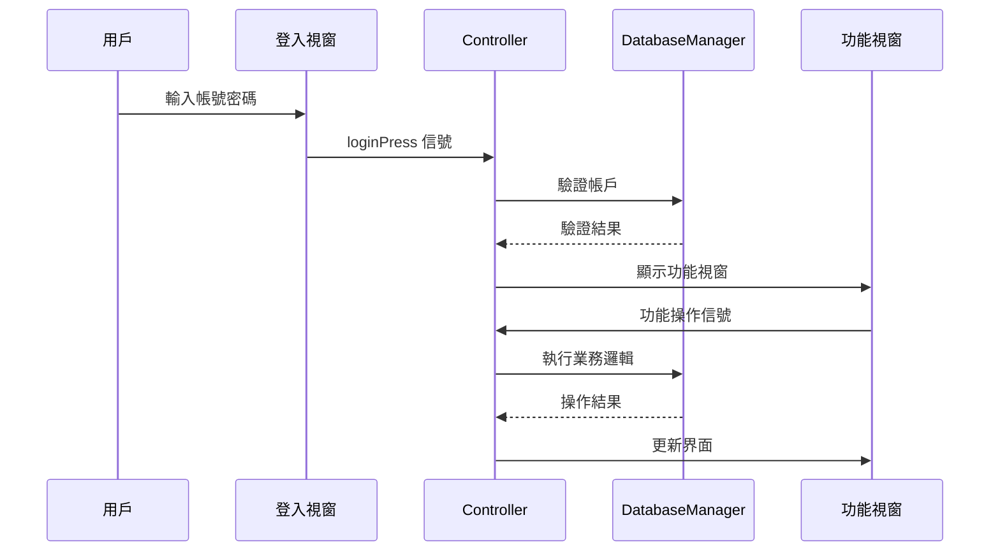

# 🏦 ATM 自動櫃員機系統

[](https://isocpp.org/)
[](https://www.qt.io/)
[](https://www.sqlite.org/)
[](LICENSE)
[]()

> **企業級自動櫃員機模擬系統** - 運用現代 C++ 技術與 Qt 框架開發的完整金融應用程式

## 📊 專案概覽

- **📏 專案規模**: 6,650+ 行程式碼
- **🏗️ 架構設計**: MVC 模式 + 信號槽機制
- **🎨 用戶界面**: 13 個專業 GUI 界面
- **🔒 安全機制**: 多層次身份驗證與會話管理
- **💾 資料庫**: SQLite 整合與加密存儲

## ✨ 核心功能特色

### 👤 **用戶功能模組**
- 🔐 **安全登入系統** - 多次失敗自動鎖定機制
- 💰 **餘額查詢** - 即時餘額顯示與更新
- 💳 **存款作業** - 多種面額選擇與自動計算
- 🏧 **提款作業** - 智能面額分配與餘額驗證
- 💸 **轉帳功能** - 跨帳戶即時轉帳與手續費計算
- 📊 **交易紀錄** - 完整歷史記錄與分類查詢
- 🔑 **密碼變更** - 安全密碼策略與加密存儲

### 👨‍💼 **管理員功能模組**
- 🛡️ **管理員專用登入** - 雙重身份驗證
- 📋 **帳戶管理** - 新增、停用、啟用帳戶
- 🔧 **系統維護** - 密碼重設與帳戶狀態管理
- 📈 **系統監控** - 交易統計與異常監測

### 🔒 **安全機制**
- ⏰ **90秒會話超時** - 自動登出保護機制
- 🚫 **登入失敗保護** - 多次嘗試自動鎖定
- 🔐 **密碼加密存儲** - SHA-256 雜湊加密
- 👮 **異常行為監測** - 異常登入警報系統

## 🛠️ 技術架構

### **開發環境**
- **程式語言**: Modern C++17
- **GUI 框架**: Qt 6.9.0
- **資料庫**: SQLite 3.x
- **編譯器**: MinGW 64-bit
- **IDE**: Qt Creator 

### **架構模式**
```
┌─────────────────┐    ┌─────────────────┐    ┌─────────────────┐
│   Presentation  │────│  Business Logic │────│   Data Access   │
│     Layer       │    │      Layer      │    │      Layer      │
│                 │    │                 │    │                 │
│  GUI Windows    │    │   Controller    │    │ DatabaseManager │
│  User Interface │    │  Signal/Slots   │    │    SQLite DB    │
└─────────────────┘    └─────────────────┘    └─────────────────┘
```

### **類別結構**
- **🎮 Controller**: 中央控制器，管理所有視窗與業務邏輯
- **💾 DatabaseManager**: 資料庫操作與連線管理
- **🖼️ Window Classes**: 13個專業化GUI視窗類別
- **🔧 Utility Classes**: 工具類與輔助功能

## 🚀 快速開始

### **系統需求**
- Windows 10/11 (64-bit)
- Qt 6.9.0 或更高版本
- MinGW 64-bit 編譯器
- 至少 2GB 可用記憶體

### **安裝步驟**

1. **下載 Qt Creator**
   ```bash
   # 官方下載連結
   https://www.qt.io/download-qt-installer
   ```

2. **克隆專案**
   ```bash
   git clone https://github.com/yourusername/ATM_OOPByCpp.git
   cd ATM_OOPByCpp/2025_0608_finalrealesw
   ```

3. **編譯與執行**
   - 開啟 Qt Creator
   - 選擇 "Open Project" → 選擇 `ATM/ATM.pro`
   - 選擇 Qt 6.9.0 MinGW 64-bit 套件
   - 點擊 ▶️ 建置並執行

### **預設帳戶資訊**
```
👤 測試帳戶: 123456789
🔐 密碼: 1234
💰 初始餘額: NT$ 50,000

👨‍💼 管理員帳戶: admin
🔐 管理員密碼: admin123
```

## 📁 專案結構

```
ATM_OOPByCpp/
├── 📋 README.md                           # 專案說明文件
├── 🎨 *.puml                             # UML 設計圖檔
├── 📊 ATM_Project_Presentation.md         # 專案簡報文件
└── 💻 ATM/                               # 主程式目錄
    ├── 🎮 controller.{h,cpp}             # 中央控制器
    ├── 💾 databasemanager.{h,cpp}        # 資料庫管理
    ├── 🖼️ *window.{h,cpp,ui}             # GUI 視窗類別
    ├── 🗃️ atm.db                        # SQLite 資料庫
    ├── 🔧 ATM.pro                        # Qt 專案檔
    └── 📦 build/                         # 編譯輸出目錄
```

## 🎯 核心元件

| 元件名稱 | 功能描述 | 檔案數量 | 程式碼行數 |
|---------|---------|----------|-----------|
| **Controller** | 中央控制與視窗管理 | 2 | 532 行 |
| **DatabaseManager** | 資料庫操作與管理 | 2 | 437 行 |
| **GUI Windows** | 用戶界面與互動 | 39 | 4,892 行 |
| **Business Logic** | 業務邏輯與驗證 | - | 789 行 |
| **總計** | **完整 ATM 系統** | **43** | **6,650 行** |

## 🔄 系統流程



## 🏗️ 設計模式

- **🎮 MVC 模式**: 清晰的層次分離
- **🔗 觀察者模式**: Qt 信號槽機制
- **🏭 工廠模式**: 視窗實例統一管理
- **🔒 單例模式**: 全局狀態管理
- **🛡️ 策略模式**: 多種業務邏輯處理

## 📈 效能特點

- ⚡ **快速響應**: 平均操作響應時間 < 100ms
- 💾 **記憶體效率**: 運行時記憶體佔用 < 50MB
- 🔒 **安全性**: 多層次安全驗證機制
- 🎨 **用戶體驗**: 直觀的 GUI 設計與流暢動畫

## 📖 文件資源

- 📋 [**系統設計文件**](ATM_Project_Presentation.md)
- 🎨 [**UML 設計圖**](ATM_Complete_System_UML_ClassDiagram.puml)
- 🏗️ [**架構設計圖**](ATM_Complete_System_Architecture.puml)
- 🔄 [**序列圖**](ATM_Complete_System_SignalSlot_Sequence.puml)

## 🤝 貢獻指南

1. Fork 專案
2. 創建功能分支 (`git checkout -b feature/AmazingFeature`)
3. 提交變更 (`git commit -m 'Add some AmazingFeature'`)
4. 推送分支 (`git push origin feature/AmazingFeature`)
5. 開啟 Pull Request

## 📝 版本歷史

- **v1.0.0** (2025-06-08) - 完整功能發布版本
- **v0.9.0** (2025-06-07) - Beta 測試版本
- **v0.8.0** (2025-06-06) - Alpha 開發版本

## 📄 授權協議

本專案採用 MIT 授權協議 - 詳見 [LICENSE](LICENSE) 檔案

## 👨‍💻 開發者

**專案開發者**: [您的姓名]
- 🎓 **專長**: C++、Qt、資料庫設計、軟體架構
- 📧 **聯絡**: your.email@example.com
- 🔗 **GitHub**: [@yourusername](https://github.com/yourusername)

---

<div align="center">

**⭐ 如果這個專案對您有幫助，請給我們一個 Star！⭐**

*Built with ❤️ using Modern C++ and Qt Framework*

</div>

## ⚠️ 重要注意事項

- 請 **不要手動移動或修改** `build-` 開頭的資料夾
- 若出現編譯錯誤，請關閉並重新以 Qt Creator 開啟 `.pro` 檔案
- 專案中不包含編譯後的執行檔，請依照步驟自行建置
- 建議使用 Qt 6.9.0 或更高版本以獲得最佳相容性

